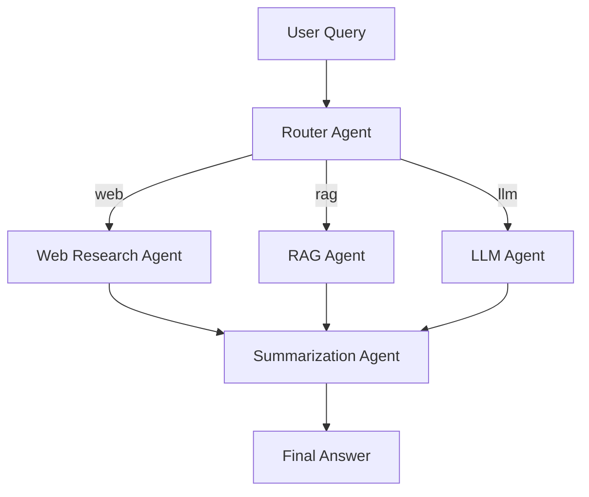

# 🔍 Multi-Agent Research & Summarization System

A powerful research assistant built with **LangGraph**, capable of intelligently routing queries to the most suitable agent—**LLM**, **Web Research**, or **Retrieval-Augmented Generation (RAG)**—and providing a structured summary using advanced LLM capabilities.

---

## 🚀 Features

- **🔀 Router Agent**: Classifies and routes queries to the appropriate agent (LLM, RAG, or Web).
- **🌐 Web Research Agent**: Performs live internet searches for real-time information.
- **📚 RAG Agent**: Retrieves relevant data from a local document knowledge base using vector search.
- **🧠 LLM Agent**: Handles general reasoning tasks using an LLM.
- **📝 Summarization Agent**: Synthesizes and structures final answers from raw responses.
- **🖥️ Streamlit UI**: Clean, modern, and interactive frontend for seamless user experience.

---

## 🧠 Architecture



- **Router Agent** selects the right processing path.
- The selected agent gathers or generates the necessary information.
- **Summarization Agent** ensures the response is clean, concise, and useful.

---

## ⚙️ Setup Instructions

### 1. Prerequisites
- Python 3.8+
- [✅ Gemini API Key](https://ai.google.dev/gemini-api/docs/get-started)

### 2. Installation

```bash
# Navigate to project directory
cd "11) Multi-Agent Research and Summarization System"

# Install required packages
pip install -r requirements.txt
```

### 3. Configure Gemini API Key

Open `app.py` and replace the placeholder with your Gemini key:

```python
GOOGLE_API_KEY = "YOUR_GEMINI_API_KEY_HERE"
```

### 4. (Optional) Add Knowledge Base Documents

Add `.pdf`, `.txt`, or `.docx` files to a folder named `my_docs/` in the project root for RAG-based retrieval.

### 5. Run the App

```bash
streamlit run app.py
```

Your browser will open with the Streamlit interface.

---

## 💡 How to Use

1. Enter your research question into the input box.
2. Click **Submit**.
3. The system will:
   - Route the query to the appropriate agent.
   - Process the response.
   - Display a clear, summarized answer.

---

## 🧪 Example Queries

| Query                                      | Routed To         | Result Example                           |
|-------------------------------------------|-------------------|------------------------------------------|
| What is LangGraph?                        | RAG / LLM         | LangGraph is a Python framework for building agent workflows. |
| What is the latest news about AI?         | Web Research      | Summary of the latest AI news online.    |
| Summarize the content of my uploaded PDF. | RAG               | Concise summary of your document.        |

---

## 🧭 Agent Routing Logic

- Queries containing **"latest"**, **"current"**, or related keywords → **Web Research Agent**
- Queries related to your **uploaded documents** → **RAG Agent**
- All other general-purpose questions → **LLM Agent**

All agent outputs are refined by the **Summarization Agent**.

---

## 🛠 Technologies Used

- **[Streamlit](https://streamlit.io/)** — UI development
- **[LangChain](https://python.langchain.com/)** — LLM tools and chains
- **[LangGraph](https://langchain-ai.github.io/langgraph/)** — Agent workflow framework
- **[Google Gemini API](https://ai.google.dev/gemini-api)** — Language model
- **[FAISS](https://github.com/facebookresearch/faiss)** — Vector search for RAG
- **[DuckDuckGo Search](https://duckduckgo.com/)** — Web search

---

## 📄 License

This project is intended for educational and research purposes only.

---
